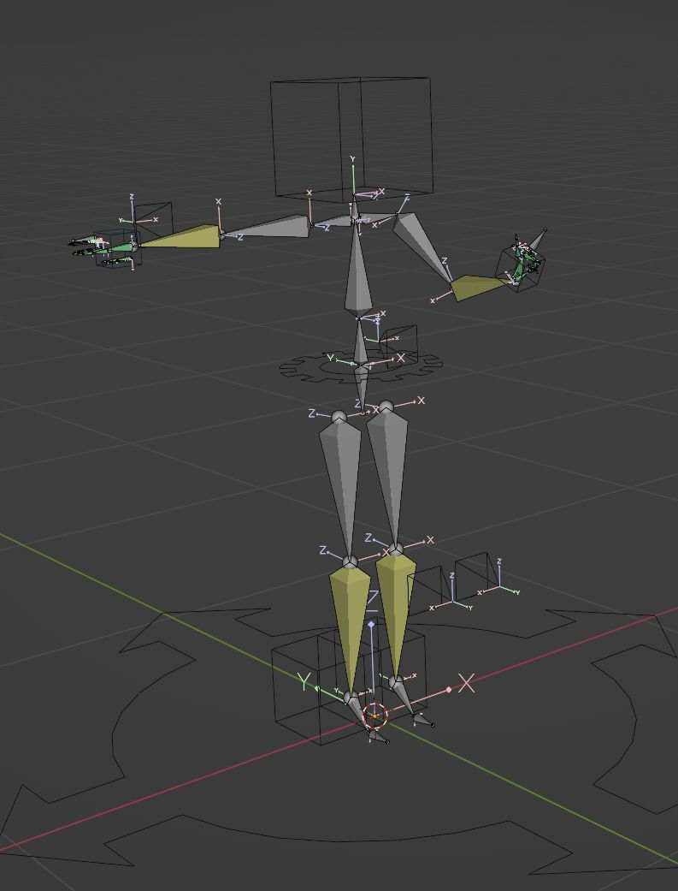

# VRM Humanoid for blender

- Add custom property `bpy.types.Armature.humanoid` to Armature
- Assign `HumanBone` to bone of Armature
- Copy `VRMC_vrm_pose` to clipboard based on `HumanBone` assignment

## Create a new Armature Humanoid

`Add - Armature - Create Humanoid`

## Humanoid Panel

`VIEW_3D` - `UI(right side)`  - `Humanoid(tab)`

### Assignment of HumanBone

- `Guess Humanoid Bones`: Attempts to assign HumanBone if blank
  - HumanBone can be assigned to Rig derived from `Rigify`
  - HumanBone can be assigned to vrm0 imported by `VRM-Addon-for-Blender`
  - HumanBone can be assigned to vrm1 imported by `VRM-Addon-for-Blender`
- `clear`: clear HumanBone assignment

### Add Rig to Humanoid

- InvertedPelvis(hips are hidden and replaced by downward facing pelvis and COG is added to its parent)
- LegIk
- ArmIk
- HandController
  - finger bend(rot, scale)
  - finger spread(rot)



Custom shape part using `boneWidget`

### Copy pose (text) to Clipboard

> As a prerequisite, rest pose must be TPose.

- `Copy Pose To Humanoid`: Copy the pose in `VRMC_vrm_pose` format to the clipboard.

## VRMC_vrm_pose (Proposal)

```json5
extensions: {
  VRMC_vrm_animation: {
    humanoid : {
      humanBones: {}
    },
    extensions: {
      VMRC_vrm_pose: {
        humanoid: {
          translation: [
            0,
            1,
            0
          ],
          rotations: {
            hips: [
              0,
              0.707,
              0,
              0.707
            ],
            spine: [
              0,
              0.707,
              0,
              0.707
            ],
            // ...
          }
        },
        expressions: {
          preset: {
            happy: 1.0,
          },
        },
        lookAt: {
          position: [
            4,
            5,
            6
          ],
          // yawPitchDegrees: [20, 30],
        }
      }
    }
  }
}
```
